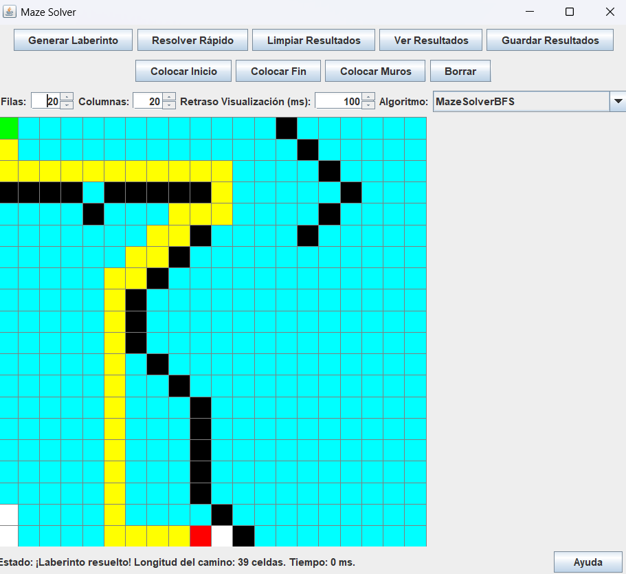
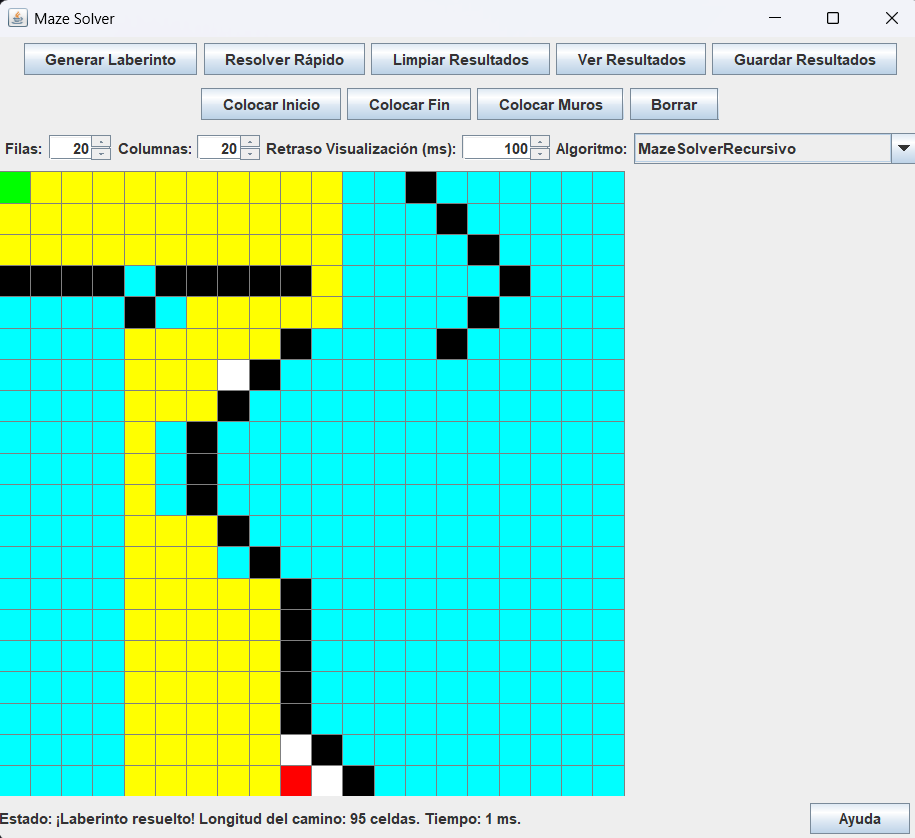

# Solución de Laberintos con Algoritmos de Búsqueda

## Integrantes
> * Jose Avecillas
> * Mateo Namicela 
> * Dennis Peñaranda
> * Alexander Beltrán

---

## 1. Descripción del Problema

Este proyecto aborda el problema clásico de encontrar una ruta desde un punto de inicio hasta una salida dentro de un laberinto. La solución debe considerar diferentes estrategias algorítmicas que optimicen la eficiencia del recorrido en función del tipo de laberinto y la lógica de exploración.

---

## 2. Propuesta de Solución

### Marco Teórico

Se implementaron los siguientes algoritmos de búsqueda y resolución de laberintos:

- **BFS (Breadth-First Search)** – `(MazeSolverBFS.java)`  
  Recorre el laberinto nivel por nivel (en amplitud). Garantiza encontrar el camino más corto en grafos no ponderados.

- **DFS (Depth-First Search)** – `(MazeSolverDFS.java)`  
  Explora profundamente cada posible camino antes de retroceder. Puede no encontrar el camino más corto.

- **DFS Completo** – `(MazeSolverDFSCompleto.java)`  
  Variante que explora todas las rutas posibles, útil para comparar caminos y tiempos.

- **Recursión simple** – `(MazeSolverRecursivo.java)`  
  Utiliza llamadas recursivas para explorar el laberinto desde el punto de inicio hasta una posible salida.

- **Recursión completa** – `(MazeSolverRecursivoCompleto.java)`  
  Variante recursiva que analiza todas las posibles soluciones, no se detiene en la primera.

- **Backtracking Recursivo** – `(MazeSolverRecursivoCompletoBT.java)`  
  Basado en DFS con retroceso, deshace movimientos inválidos para buscar rutas alternativas de forma recursiva y controlada.


### Tecnologías Utilizadas

- **Lenguaje:** Java
- **IDE recomendado:** IntelliJ IDEA / NetBeans
- **Framework GUI:** Swing
- **Manejo de datos:** Almacenamiento en archivos con DAO

### Diagrama UML


### Capturas de la Interfaz

Se muestran a continuación capturas que reflejan el funcionamiento del sistema en dos laberintos distintos utilizando diferentes algoritmos:

- Laberinto 1: Maze Solver BFS
    
- Laberinto 2: Maze Solver Recursivo
    


### Código Ejemplo

A continuación se muestra una sección del algoritmo `MazeSolverRecursivoCompletoBT.java`:

```java
public boolean solveMaze(int row, int col) {
    if (!isValidMove(row, col)) return false;
    if (isExit(row, col)) return true;

    maze[row][col] = VISITED;

    for (Direction d : Direction.values()) {
        if (solveMaze(row + d.dx, col + d.dy)) return true;
    }

    maze[row][col] = UNVISITED; // backtrack
    return false;
}
